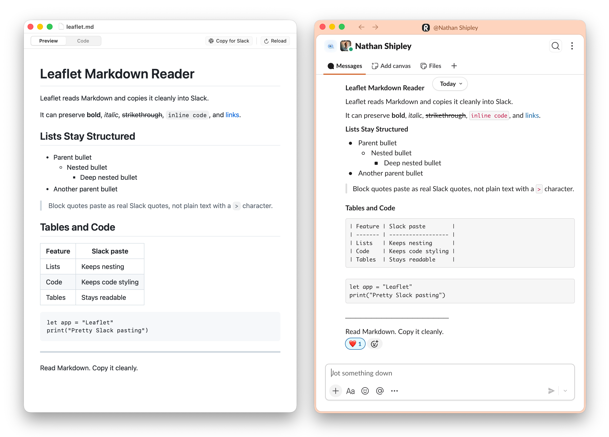

<p align="center">
  
</p>

**A simple Markdown reader with pretty Slack pasting.**

Leaflet is a native macOS Markdown reader built around one daily annoyance: getting Markdown into Slack without losing structure.

It is intentionally **not** a Markdown editor. Think TextEdit or Preview for Markdown, with first-class Slack paste.

## Download the beta

<table>
  <tr>
    <td width="64">
      <a href="https://github.com/nathanshipley/leaflet-md/releases/download/v0.1.0-beta.11/Leaflet-v0.1.0-beta.11-macOS-universal.dmg">
        
      </a>
    </td>
    <td>
      <a href="https://github.com/nathanshipley/leaflet-md/releases/download/v0.1.0-beta.11/Leaflet-v0.1.0-beta.11-macOS-universal.dmg">
        <strong>Download Leaflet v0.1.0-beta.11 for macOS</strong>
      </a>
      <br>
      Apple Silicon and Intel Macs, macOS 13+, signed and notarized.
    </td>
  </tr>
</table>

## What Leaflet does

- Opens Markdown and plain text files in native Mac document windows
- Shows a clean rendered Preview and a raw Code view
- Supports Find, tabs, drag/drop, Open Recent, and Reload
- Creates temporary documents from clipboard Markdown
- Copies rich Markdown into Slack with nested lists, code blocks, tables, and inline formatting intact

The signature feature is **Copy for Slack**. It writes Slack's rich clipboard format so pastes can preserve structure in both Slack desktop and Slack in Chrome.

<p align="center">
  
</p>

### Two ways people are using it

- **Pasting LLM responses into Slack.** Copy a ChatGPT or Claude reply, drop it into a Leaflet window with `New from Clipboard`, and `Copy for Slack` — bullets, code blocks, headings, and tables come through cleanly.
- **Bridging Workflowy → Slack.** Workflowy's own copy-for-Slack drops formatting whenever a list item also contains styled text. Pasting through Leaflet preserves both the list structure and the inline formatting in one go.

## Known limitations

- macOS 13+, Apple Silicon and Intel (universal binary)
- Opened files are read-only by design
- Slack paste depends on Slack's current clipboard behavior

## Development

Open `Leaflet.xcodeproj` in Xcode and press Run to build and launch the app. Requires Xcode 26 or newer on macOS 15+.

Unit tests run from the command line:

```bash
swift test
```

Release packaging is currently cut from the public mirror with the Xcode Release build and `scripts/build_dmg.sh`.

The public product name is Leaflet. Some internal Swift package, module, and folder names still use `MarkdownViewer` for now.

## License

Apache License 2.0. See [LICENSE](LICENSE) and [NOTICE](NOTICE).

If you fork or distribute a modified version, please preserve the license and notice files and make it clear that your version has been modified from the original Leaflet project.
